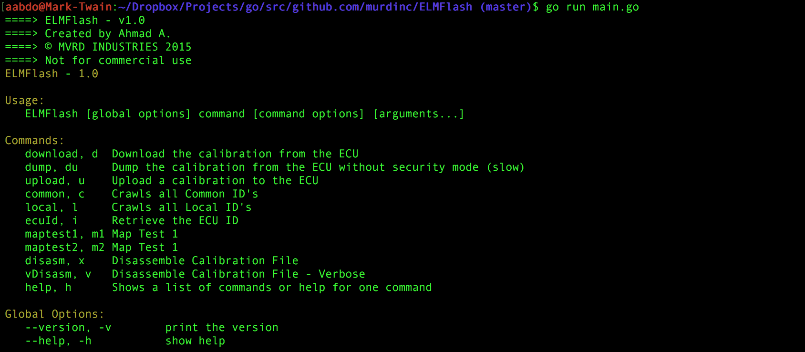
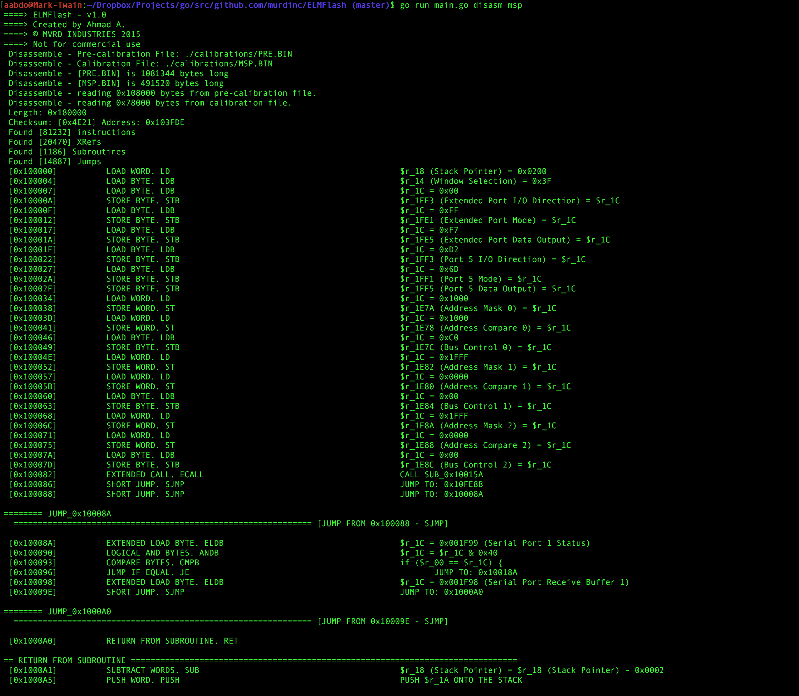

# ELMFlash
ELMFlash is a CLI tool for reverse engineering the Electronic Control Unit (ECU) on my car. It is written in Go, and is not yet complete. 

This tool utilizes an ELM 327 chip for communicating to the ECU through ISO9141 over the OBD-II port. These are readily available in USB, WIFI, and Bluetooth products, but I would suggest trying to stay away from the ones with bootleg chips - as they have questionable circuit designs. This is currently setup to connect to the ID of the ELMScan 5. The MCU on this car is a Intel 196EA variant (manufacturer proprietary) and memory is a vanilla Intel 28F400 Flash chip. 

Much of this was built by sniffing the packets being sent by the OEM supplied ECU flashing tool, and comparing that to datasheets for the specific OBD protocol. The disassembly and pseudo-code output was built by referencing the datasheets for the 196 and making (hopefully) informed assumptions. Calibrations were pulled both from a EEPROM reader and by using this program to dump the memory in security mode. 

Currently, I am trying to make sense of the disassembly and make that output more verbose. I am using a desk rig for testing that includes an electronic engine simulator (JimStim), and a modified ECU with cold-swappable Flash chips. 

**Current capabilities:** 
* Enters Security Mode
* Download the entire memory address block
* Upload a new calibration
* Returns the ID of the calibration
* Scan all Common ID's and Local ID's 
* Disassemble BIN calibrations
* Generate Pseudo-code from disassembly 
* Names variables and address spaces documented in the datasheets.
* Identifies patterns of hex that represent Map/Table data. 

**Up Next:**
* Find the proper start address and build a sofware simulator to run through the code. 
* Run a bus pirate on the service port of the ECU / Identify results from the logic analyzer.
* Trace circuit on PCB from the MCU ports to spark and fuel wires.
* Modify and upload a custom calibration. 
* Stop using local import paths? Maybe break it out into seperate libraries?  

**CLI Menu:**

**Disassembly Output:**

